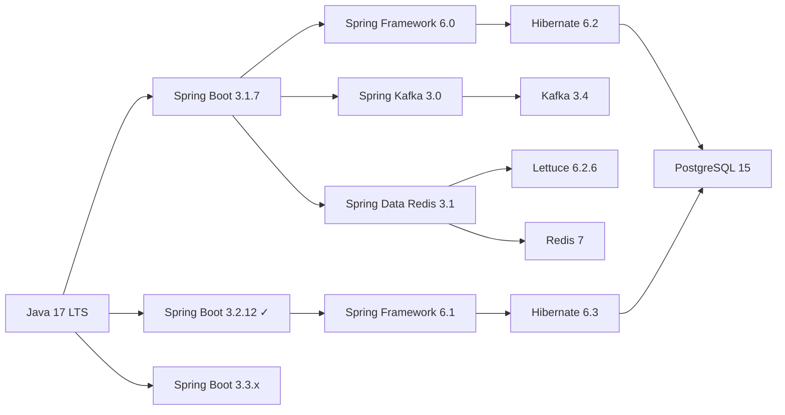
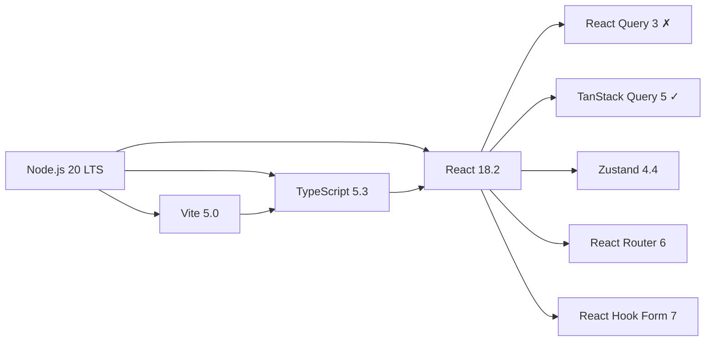

# Component Compatibility Matrix

## 🔗 Backend Compatibility Chart



### ✅ Verified Compatibility

| Base Component | Compatible With | Version Range | Status |
|----------------|-----------------|---------------|---------|
| **Java 17** | Spring Boot | 3.0.0 - 3.3.x | ✅ Fully Compatible |
| **Java 17** | Gradle | 7.3+ | ✅ Works with 8.5 |
| **Java 21** | Spring Boot | 3.2.0+ | ✅ But not required |
| | | | |
| **Spring Boot 3.1.7** | Spring Framework | 6.0.x | ✅ Auto-managed |
| **Spring Boot 3.1.7** | Spring Security | 6.1.x | ✅ Auto-managed |
| **Spring Boot 3.1.7** | Spring Data JPA | 3.1.x | ✅ Auto-managed |
| **Spring Boot 3.1.7** | Hibernate | 6.2.x | ✅ Auto-managed |
| **Spring Boot 3.1.7** | Jakarta EE | 10.0 | ✅ Compatible |
| | | | |
| **Spring Boot 3.2.12** | Spring Framework | 6.1.x | ✅ Auto-managed |
| **Spring Boot 3.2.12** | Hibernate | 6.4.x | ✅ Auto-managed |
| **Spring Boot 3.2.12** | Java | 17-21 | ✅ Broader support |

### 🔄 Database & Persistence

| Component | Driver/Client | Server | Status |
|-----------|--------------|---------|--------|
| **PostgreSQL 15** | 42.6.x - 42.7.x | JDBC Driver | ✅ Compatible |
| **PostgreSQL 15** | Hibernate 6.2+ | ORM | ✅ Full support |
| **PostgreSQL 15** | Liquibase 4.x | Migration | ✅ Compatible |
| **PostgreSQL 16** | All above | | ✅ Backward compatible |
| **PostgreSQL 17** | All above | | ⚠️ Too new, wait |

### 📡 Messaging & Caching

| Component | Client Library | Protocol | Server Version | Status |
|-----------|---------------|----------|----------------|---------|
| **Kafka CP 7.4** | Spring Kafka 3.0 | 3.4 | Kafka 3.4.x | ✅ Matched |
| **Kafka CP 7.4** | Java Client | 3.4 | | ✅ Compatible |
| **Redis 7** | Lettuce 6.2.6 | RESP3 | 7.0-7.4 | ✅ Compatible |
| **Redis 7** | Lettuce 6.3.2 | RESP3 | 7.0-7.4 | ✅ Better |
| **Redis 7** | Spring Data Redis 3.1 | | | ✅ Full support |

---

## 🎨 Frontend Compatibility Chart



### ✅ Verified Compatibility

| Base Component | Compatible With | Version Range | Status |
|----------------|-----------------|---------------|---------|
| **Node.js 20** | npm | 9.0+ | ✅ Bundled |
| **Node.js 20** | React | 16.8+ | ✅ Full support |
| **Node.js 20** | Vite | 4.0+ | ✅ Optimized |
| **Node.js 20** | TypeScript | 4.5+ | ✅ Works great |
| | | | |
| **React 18.2** | TypeScript | 4.7+ | ✅ Full types |
| **React 18.2** | React Query 3 | | ❌ Deprecated |
| **React 18.2** | TanStack Query | 4.0+ | ✅ Recommended |
| **React 18.2** | React Router | 6.4+ | ✅ Compatible |
| **React 18.2** | Zustand | 4.0+ | ✅ Works well |
| | | | |
| **Vite 5.0** | Node.js | 18+ | ✅ Required |
| **Vite 5.0** | TypeScript | 5.0+ | ✅ Recommended |
| **Vite 5.0** | React | 16.8+ | ✅ Fast refresh |
| **Vite 6.0** | Node.js | 18+ | ✅ Compatible |
| **Vite 6.0** | Config format | | ⚠️ Breaking changes |

### 🎯 UI Library Compatibility

| Library | React Version | TypeScript | Status |
|---------|--------------|------------|---------|
| **Tailwind 3.3** | Any | Optional | ✅ Framework agnostic |
| **Tailwind 3.4** | Any | Optional | ✅ New features |
| **Framer Motion 10** | 18+ | ✅ | ✅ Stable |
| **Framer Motion 11** | 18+ | ✅ | ⚠️ API changes |
| **Radix UI 1.0** | 18+ | ✅ | ✅ Stable |

---

## 🐳 Infrastructure Compatibility

| Component | Version | Compatible With | Status |
|-----------|---------|-----------------|---------|
| **Docker 27.1** | Compose v2 | All services | ✅ Latest |
| **PostgreSQL 15** | Docker | Linux Alpine | ✅ Optimized |
| **Redis 7** | Docker | Linux Alpine | ✅ Small image |
| **Kafka CP 7.4** | Zookeeper | 3.8.x | ✅ Traditional |
| **Kafka CP 7.4** | KRaft mode | Built-in | ✅ No Zookeeper |
| **Prometheus** | Grafana | Any version | ✅ Standard metrics |

---

## ⚠️ Known Incompatibilities

### Critical Issues

1. **React Query 3.x** ↔ **React 18 Strict Mode**
   - Issue: Double rendering causes problems
   - Solution: Upgrade to @tanstack/react-query v5

2. **Flyway** ↔ **Liquibase**
   - Issue: Both trying to manage migrations
   - Solution: Remove Flyway, use only Liquibase

3. **Jedis** ↔ **Lettuce**
   - Issue: Conflicting Redis clients
   - Solution: Already removed Jedis

### Version Conflicts to Avoid

| Don't Mix | With | Reason |
|-----------|------|---------|
| Spring Boot 2.x | Java 17+ | Incompatible |
| Spring Boot 3.x | Java 11 | Requires Java 17+ |
| React 18 | React Query 3 | Deprecated, issues |
| Vite 6 | Old config format | Breaking changes |
| Node 16 | Vite 5+ | Requires Node 18+ |
| PostgreSQL JDBC 42.5 | Java 8 | Requires Java 8+ |

---

## 🔮 Future Compatibility Planning

### Coming Soon (Next 6 Months)

| Component | Current | Coming | Impact |
|-----------|---------|---------|---------|
| Spring Boot 3.1 | EOL Feb 2025 | Must upgrade | High |
| Node.js 20 | LTS until 2026 | Stable | Low |
| Java 17 | LTS until 2029 | Very stable | None |
| React 18 | Stable | React 19 beta | Low |
| PostgreSQL 15 | Supported until 2027 | Stable | None |

### Recommended Upgrade Path

```
Current State          →  Phase 1 (Now)       →  Phase 2 (Q1 2025)   →  Phase 3 (Q2 2025)
─────────────             ───────────             ─────────────           ──────────────
Spring Boot 3.1.7    →    Spring Boot 3.2.12  →  Spring Boot 3.2.x   →  Evaluate 3.3.x
React Query 3        →    TanStack Query 5    →  Stable              →  -
Node.js 20.18.1      →    Node.js 20.18.2     →  Stay on 20 LTS     →  -
Vite 5.0             →    Vite 5.4            →  Evaluate Vite 6    →  Vite 6 if stable
Java 17              →    Stay on Java 17     →  Stay on Java 17    →  Evaluate Java 21
```

---

## 📊 Risk Assessment

| Upgrade | Risk Level | Effort | Benefit | Recommendation |
|---------|------------|---------|----------|----------------|
| Spring Boot 3.1 → 3.2 | Low | Low | High | ✅ Do now |
| React Query → TanStack | Medium | High | Critical | ✅ Must do |
| Java 17 → 21 | Low | Medium | Low | ⏸️ Wait |
| Vite 5 → 6 | Medium | Medium | Low | ⏸️ Wait |
| Node 20 → 22 | Low | Low | Low | ⏸️ Wait |
| PostgreSQL 15 → 16 | Low | High | Low | ❌ Don't |

---

## ✅ Compatibility Testing Checklist

### After Any Upgrade

- [ ] Backend compiles: `./gradlew clean build`
- [ ] Backend tests pass: `./gradlew test`
- [ ] Frontend compiles: `npm run build`
- [ ] Frontend tests pass: `npm test`
- [ ] Docker builds: `docker-compose build`
- [ ] Services start: `docker-compose up -d`
- [ ] Health checks pass: Check `/actuator/health`
- [ ] API works: Test key endpoints
- [ ] UI loads: Check browser console
- [ ] Data persists: Test CRUD operations

---

*This matrix is current as of 2025-08-17. Review monthly for updates.*