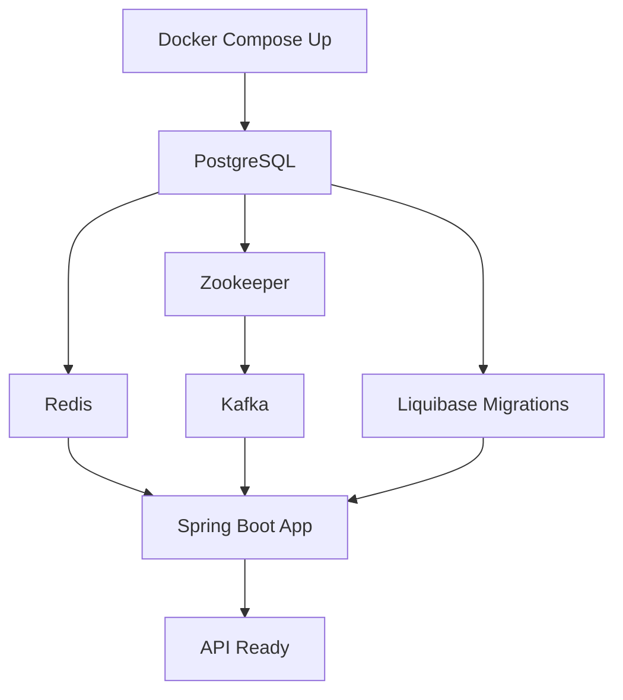

# Project Startup Guide (Backend & Infrastructure)

## 🚀 Quick Start Steps

### Step 1: Environment Setup (5 minutes)

```bash
# 1. Copy environment template
cp .env.example .env

# 2. Edit .env file and set REQUIRED values:
```

**Required Environment Variables:**
```bash
# Database
POSTGRES_PASSWORD=your_secure_password_here
DB_PASSWORD=your_secure_password_here

# Redis
REDIS_PASSWORD=your_redis_password_here

# JWT Security
JWT_SECRET=your-super-secret-jwt-key-minimum-64-characters-long

# External APIs (if using)
BINOM_API_KEY=your_binom_key
YOUTUBE_API_KEY=your_youtube_key
CRYPTOMUS_API_KEY=your_cryptomus_key
```

### Step 2: Start Infrastructure Services (10 minutes)

```bash
# Option A: Start all services (includes monitoring)
docker-compose up -d

# Option B: Start only essential services
docker-compose up -d postgres redis kafka zookeeper

# Option C: Use KRaft mode (no Zookeeper)
docker-compose -f docker-compose-kafka-kraft.yml up -d
```

**Wait for services to be healthy:**
```bash
# Check status
docker-compose ps

# Watch logs
docker-compose logs -f postgres redis kafka
```

### Step 3: Initialize Database (5 minutes)

```bash
# Database will auto-initialize from init-scripts/
# But verify migrations ran:

# Check Liquibase migrations
docker exec smm_postgres psql -U smm_admin -d smm_panel -c "SELECT * FROM databasechangelog ORDER BY orderexecuted DESC LIMIT 5;"

# If migrations didn't run, manually apply:
cd backend
./gradlew liquibaseUpdate
```

### Step 4: Build Backend (5 minutes)

```bash
cd backend

# Clean build
./gradlew clean build -x test

# Or with tests
./gradlew clean build
```

### Step 5: Start Backend Application (2 minutes)

```bash
# Option A: Using Gradle (Development)
./gradlew bootRun

# Option B: Using JAR (Production-like)
java -jar build/libs/smmpanel-1.0.0.jar

# Option C: Using Docker (Production)
docker-compose up -d spring-boot-app

# Option D: With specific profile
SPRING_PROFILES_ACTIVE=dev ./gradlew bootRun
```

### Step 6: Verify Services Health

```bash
# 1. Check backend health
curl http://localhost:8080/api/actuator/health

# 2. Check database connection
docker exec smm_postgres psql -U smm_admin -d smm_panel -c "SELECT COUNT(*) FROM users;"

# 3. Check Redis
docker exec smm_redis redis-cli -a ${REDIS_PASSWORD} ping

# 4. Check Kafka
docker exec smm_kafka kafka-topics --bootstrap-server localhost:9092 --list
```

---

## 📋 Detailed Startup Checklist

### Pre-flight Checks
- [ ] Java 17+ installed: `java -version`
- [ ] Docker installed: `docker --version`
- [ ] Docker Compose installed: `docker-compose --version`
- [ ] Port 5432 (PostgreSQL) available
- [ ] Port 6379 (Redis) available
- [ ] Port 9092 (Kafka) available
- [ ] Port 8080 (Spring Boot) available

### Infrastructure Services

```bash
# 1. PostgreSQL
docker-compose up -d postgres
# Wait for: "database system is ready to accept connections"

# 2. Redis
docker-compose up -d redis
# Wait for: "Ready to accept connections"

# 3. Kafka (with Zookeeper)
docker-compose up -d zookeeper
docker-compose up -d kafka
# Wait for: "Kafka Server started"

# 4. Create Kafka topics (auto-created on first use, but can manual create)
docker exec smm_kafka kafka-topics --bootstrap-server localhost:9092 \
  --create --topic order-events --partitions 6 --replication-factor 1

docker exec smm_kafka kafka-topics --bootstrap-server localhost:9092 \
  --create --topic video-processing-events --partitions 3 --replication-factor 1
```

### Backend Application

```bash
# 1. Install dependencies (first time only)
cd backend
./gradlew build --refresh-dependencies

# 2. Run database migrations
./gradlew liquibaseUpdate

# 3. Start application
./gradlew bootRun --args='--spring.profiles.active=dev'
```

---

## 🔍 Verification Commands

### Service Health Checks

```bash
# Complete health check script
cat << 'EOF' > check-health.sh
#!/bin/bash

echo "=== Checking Service Health ==="

# PostgreSQL
echo -n "PostgreSQL: "
docker exec smm_postgres pg_isready -U smm_admin -d smm_panel &>/dev/null && echo "✓ Healthy" || echo "✗ Failed"

# Redis
echo -n "Redis: "
docker exec smm_redis redis-cli ping &>/dev/null && echo "✓ Healthy" || echo "✗ Failed"

# Kafka
echo -n "Kafka: "
docker exec smm_kafka kafka-broker-api-versions --bootstrap-server localhost:9092 &>/dev/null && echo "✓ Healthy" || echo "✗ Failed"

# Spring Boot
echo -n "Spring Boot: "
curl -s http://localhost:8080/api/actuator/health | grep -q "UP" && echo "✓ Healthy" || echo "✗ Failed"

echo ""
echo "=== Port Status ==="
netstat -an | grep -E ":(5432|6379|9092|8080).*LISTEN" || lsof -i :5432,6379,9092,8080
EOF

chmod +x check-health.sh
./check-health.sh
```

### API Testing

```bash
# 1. Health endpoint
curl http://localhost:8080/api/actuator/health | jq .

# 2. Get services list (public endpoint)
curl http://localhost:8080/api/v1/services | jq .

# 3. Test authentication (register)
curl -X POST http://localhost:8080/api/v1/auth/register \
  -H "Content-Type: application/json" \
  -d '{
    "username": "testuser",
    "email": "test@example.com",
    "password": "Test123!@#"
  }' | jq .

# 4. Test with API key
curl http://localhost:8080/api/v1/account \
  -H "X-API-Key: your-api-key-here" | jq .
```

---

## 🛠️ Troubleshooting

### Issue: Cannot connect to PostgreSQL
```bash
# Check if container is running
docker ps | grep postgres

# Check logs
docker logs smm_postgres --tail 50

# Test connection
docker exec -it smm_postgres psql -U smm_admin -d smm_panel
```

### Issue: Redis connection refused
```bash
# Check Redis password in .env
echo $REDIS_PASSWORD

# Test connection with password
docker exec smm_redis redis-cli -a ${REDIS_PASSWORD} ping
```

### Issue: Kafka not starting
```bash
# Check Zookeeper first
docker logs smm_zookeeper --tail 50

# Then check Kafka
docker logs smm_kafka --tail 50

# Verify listeners
docker exec smm_kafka cat /etc/kafka/server.properties | grep listeners
```

### Issue: Spring Boot won't start
```bash
# Check for port conflicts
lsof -i :8080

# Check application logs
tail -f backend/logs/application.log

# Run with debug
./gradlew bootRun --debug
```

### Issue: Liquibase migrations failed
```bash
# Check migration status
cd backend
./gradlew liquibaseStatus

# Rollback if needed
./gradlew liquibaseRollbackCount -PliquibaseCommandValue=1

# Clear checksums
./gradlew liquibaseClearChecksums
```

---

## 🚦 Service Startup Order



**Correct startup sequence:**
1. PostgreSQL (database)
2. Redis (cache)
3. Zookeeper (Kafka coordinator)
4. Kafka (messaging)
5. Database migrations
6. Spring Boot application

---

## 📊 Optional: Monitoring Stack

```bash
# Start monitoring services
docker-compose up -d prometheus grafana

# Access dashboards
# Prometheus: http://localhost:9090
# Grafana: http://localhost:3000 (admin/admin)

# Import dashboards
# 1. JVM (Spring Boot): Dashboard ID 4701
# 2. PostgreSQL: Dashboard ID 9628
# 3. Redis: Dashboard ID 11835
# 4. Kafka: Dashboard ID 7589
```

---

## 🔄 Quick Reset (Clean Slate)

```bash
# Stop everything
docker-compose down

# Clean volumes (WARNING: Deletes all data)
docker-compose down -v

# Clean build
cd backend
./gradlew clean

# Start fresh
docker-compose up -d
cd backend
./gradlew bootRun
```

---

## 📝 Development vs Production

### Development Mode
```bash
# Use dev compose file
docker-compose -f docker-compose.dev.yml up -d

# Run with dev profile
SPRING_PROFILES_ACTIVE=dev ./gradlew bootRun

# Enable hot reload
./gradlew bootRun --continuous
```

### Production Mode
```bash
# Build optimized JAR
./gradlew build -Pprofile=prod

# Use production compose
docker-compose up -d

# Run with production settings
java -jar -Dspring.profiles.active=prod build/libs/smmpanel-1.0.0.jar
```

---

## ✅ Success Indicators

When everything is running correctly, you should see:

1. **Docker Status**: All containers "Up" and "Healthy"
2. **PostgreSQL**: Tables created, migrations completed
3. **Redis**: Responding to PING with PONG
4. **Kafka**: Topics created and listed
5. **Spring Boot**: 
   - Log shows "Started SmmPanelApplication"
   - Health endpoint returns `{"status":"UP"}`
   - Actuator endpoints accessible
6. **API**: Returns data on `/api/v1/services`

---

## 🎯 Next Steps After Startup

1. **Create admin user** via API or database
2. **Configure services** in admin panel
3. **Set up rate limits** and API keys
4. **Import test data** if needed
5. **Configure external integrations** (Binom, YouTube, etc.)
6. **Set up monitoring alerts**
7. **Test order processing flow**

---

## 📞 Common Ports Reference

| Service | Port | URL |
|---------|------|-----|
| Spring Boot API | 8080 | http://localhost:8080/api |
| PostgreSQL | 5432 | postgresql://localhost:5432/smm_panel |
| Redis | 6379 | redis://localhost:6379 |
| Kafka | 9092 | localhost:9092 |
| Zookeeper | 2181 | localhost:2181 |
| Prometheus | 9090 | http://localhost:9090 |
| Grafana | 3000 | http://localhost:3000 |
| Kafka UI | 8090 | http://localhost:8090 |

---

*Use this guide to start your backend services step by step. The frontend can be started separately when needed.*